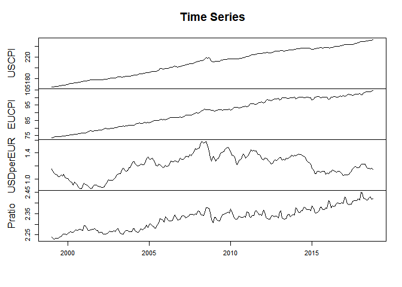

Purchasing Power Parity (PPP) Example
================
Scott W. Hegerty
Spring 2021

This is the (annotated) R code for the PPP data exercise used in ECON
321 and 343. We test the concept of relative Purchasing Power Parity:
That changes in the exchange rate are related to changes in the two
countries’ price levels. This differs from “absolute” PPP, which is in
levels, and states that two countries’ bilateral exchange rate should be
equal to the ratio of their price levels: \[E_{H/F}=P^H/P^F\] Absolute
PPP allows this ratio to be equal only proportionally–using the constant
\(k\). This is less strict, since the two values do not need to be
equal, and therefore might more closely match reality. Relative PPP is
therefore \(E_{H/F}=kP^H/P^F\). Taking the derivative of the log turns
this into percentage changes (and the derivative of a constant is zero,
so this drops out):

\[ \% \Delta  E = \pi^H-\pi^F\]

\#\#\# Procedure

Our goal is to use three data series (for the USD\_EUR exchange rate, as
well as U.S. and Eurozone price levels, to generate appreciations,
inflation rates, and other relevant variables. We will then summarize
the data and test for a relationship between currency appreciations and
the differential between inflation rates.

First, we pull the data from the course website:

``` r
data<-read.csv("https://raw.githubusercontent.com/hegerty/PPP_Example/main/PPPData.csv")
```

These were originally taken from the FRED website, which compiles time
series from a number of sources. I cleaned it beforehand–with one
exception.

A good first step is always to look at the dataset, both to make sure it
loaded correctly and to get a sense of how it is structured. I do this
on a lot of steps.

``` r
head(data)
```

    ##       DATE USCPI CP0000EZ19M086NEST USDperEUR
    ## 1 1/1/1999 164.7              73.56    1.1591
    ## 2 2/1/1999 164.7              73.72    1.1203
    ## 3 3/1/1999 164.8              73.97    1.0886
    ## 4 4/1/1999 165.9              74.23    1.0701
    ## 5 5/1/1999 166.0              74.28    1.0630
    ## 6 6/1/1999 166.0              74.27    1.0377

Note that the second variable has its original name (from Eurostat, via
FRED). The data are going to get modified anyway.

We remove the date column; it will be replaced when this is set to time
series.

``` r
data<-data[,-1]
```

Next, we add a new variable: The ratio of US to Eurozone price levels:

``` r
data$Pratio<-data[,1]/data[,2]
head(data)
```

    ##   USCPI CP0000EZ19M086NEST USDperEUR   Pratio
    ## 1 164.7              73.56    1.1591 2.238989
    ## 2 164.7              73.72    1.1203 2.234129
    ## 3 164.8              73.97    1.0886 2.227930
    ## 4 165.9              74.23    1.0701 2.234945
    ## 5 166.0              74.28    1.0630 2.234787
    ## 6 166.0              74.27    1.0377 2.235088

We next generate summary statistics for this new variable.

``` r
summary(data$Pratio)
```

    ##    Min. 1st Qu.  Median    Mean 3rd Qu.    Max. 
    ##   2.228   2.277   2.334   2.328   2.362   2.449

These are not extremely useful, however, since the data are likely not
stationary.

The next step is to make time series out of the variables in the
dataframe. The data have monthly frequency and begin in January 1999.

``` r
tsdata<-ts(data,start = c(1999,1),frequency = 12)
```

We can rename the columns (we really just need column 2, but here we do
them all):

``` r
colnames(tsdata)<-c("USCPI","EUCPI","USDperEUR","Pratio")
head(tsdata)
```

    ##      USCPI EUCPI USDperEUR   Pratio
    ## [1,] 164.7 73.56    1.1591 2.238989
    ## [2,] 164.7 73.72    1.1203 2.234129
    ## [3,] 164.8 73.97    1.0886 2.227930
    ## [4,] 165.9 74.23    1.0701 2.234945
    ## [5,] 166.0 74.28    1.0630 2.234787
    ## [6,] 166.0 74.27    1.0377 2.235088

Next, we plot the time series. One simple way is to do them all in one
graph.

``` r
plot(tsdata,xlab="",main="Time Series")
```

<!-- -->

A better way is to make a 2x2 set of separate graphs:

<!-- -->

Now, we make 12-month percentage changes using lags. This gives us U.S.
inflation, Eurozone inflation; the inflation differential (which is the
difference between the two); and exchange-rate appreciation:

``` r
usinf<-100*((tsdata[,1]/lag(tsdata[,1],-12))-1)
euinf<-100*((tsdata[,2]/lag(tsdata[,2],-12))-1)
infdiff<-usinf-euinf
PercChE<-100*((tsdata[,3]/lag(tsdata[,3],-12))-1)
```

Now, we calculate the correlation coefficient between current
appreciation and the inflation differential. We can also run an OLS
regression and generate a regression line. The regression itself is
stored as an object, but we can call a summary with all the coefficients
and other necessary regression output:

``` r
cor1<-cor(PercChE,infdiff)
reg1<-lm(PercChE~infdiff)
cor1
```

    ## [1] 0.207057

``` r
summary(reg1)
```

    ## 
    ## Call:
    ## lm(formula = PercChE ~ infdiff)
    ## 
    ## Residuals:
    ##      Min       1Q   Median       3Q      Max 
    ## -23.0027  -7.1772  -0.0226   6.8636  25.9912 
    ## 
    ## Coefficients:
    ##             Estimate Std. Error t value Pr(>|t|)   
    ## (Intercept)  -0.0705     0.7639  -0.092  0.92655   
    ## infdiff       2.7476     0.8674   3.168  0.00175 **
    ## ---
    ## Signif. codes:  0 '***' 0.001 '**' 0.01 '*' 0.05 '.' 0.1 ' ' 1
    ## 
    ## Residual standard error: 10.05 on 224 degrees of freedom
    ## Multiple R-squared:  0.04287,  Adjusted R-squared:  0.0386 
    ## F-statistic: 10.03 on 1 and 224 DF,  p-value: 0.001751

The significant \(\beta\) on *infdiff* shows that there is a positive
relationship between the two variables. But \(R^2\) is super-low.

We can make a scatterplot of all the appreciation-differential pairs. We
also include the regression line \(PercChE=-0.0705+2.7476*infdiff\) and
include the correlation coefficient in the graph:

``` r
plot(infdiff,PercChE,pch=16,main = "Correlation between Inflation and Exchange Rates")
abline(reg1,lwd=4,lty=2)
legend("bottomright", title = "Correlation =", legend=round(cor1,3),bty="n")
```

<!-- -->

We can also calculate the *coefficient of variation* for both variables.
This is the ratio of the standard deviation to the mean: large values
are likely to have high variance, so this removes that effect.

``` r
CV_INFDIFF<-sd(infdiff)/mean(infdiff)
CV_E<-sd(PercChE)/mean(PercChE)
```

We examine them and calculate the ratio between the two; notice that the
appreciation variable is five times as high as the inflation
differential.

``` r
CV_INFDIFF
```

    ## [1] 1.81391

``` r
CV_E  
```

    ## [1] 9.322075

``` r
CV_E/CV_INFDIFF
```

    ## [1] 5.139217

A table might be easier to use:

<table style='width:20%;'>

<thead>

<tr>

<th style="text-align:left;">

</th>

<th style="text-align:right;">

CV

</th>

</tr>

</thead>

<tbody>

<tr>

<td style="text-align:left;">

E

</td>

<td style="text-align:right;">

9.322075

</td>

</tr>

<tr>

<td style="text-align:left;">

INFDIFF

</td>

<td style="text-align:right;">

1.813910

</td>

</tr>

<tr>

<td style="text-align:left;">

Ratio

</td>

<td style="text-align:right;">

5.139217

</td>

</tr>

</tbody>

</table>

</br>

Finally, we plot the two time series together. Originally, I kept it
simple by multiplying the inflation differential by 5, so the variables
could be on the same graph more easily. The code for this is in th
associated .R file; it is mostly customization.

<!-- -->

It is better to keep the numbers as-is, and to use a separate axis for
each variable.

<!-- -->

In short, neither the correlation coeffcient nor a visual inspection of
the time series show a very strong relationship between inflation and
exchange rates. It exists, but it is fairly weak. This matches much of
the economic literature on PPP.
